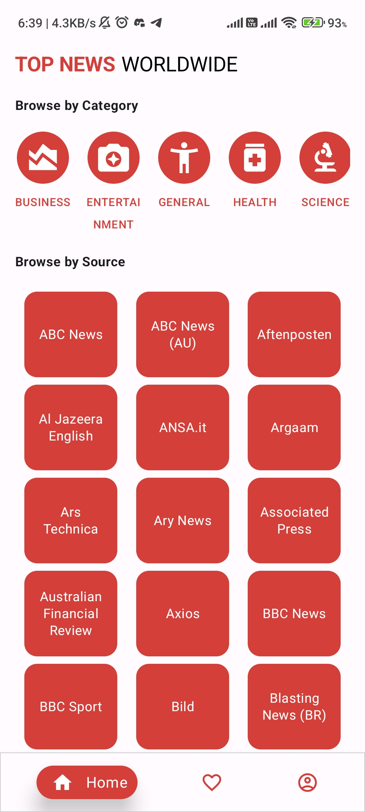
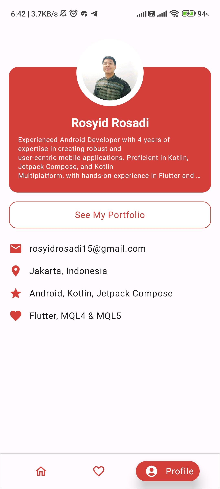

# Beritain - News App with Jetpack Compose

A modern Android news application built with Jetpack Compose, following Clean Architecture principles and MVVM pattern.

## 📱 Screenshots

| Screen   | Sceenshoot                                                        |
|----------|-------------------------------------------------------------------|
| Home     |     |
| News     |     |
| Favorite |  |
| Detail   |   |
| WebView  |  |
| Profile  |  |


## ✨ Features

- 🗞️ Latest news articles with infinite scroll
- 🔍 Search functionality
- 💾 Offline support with Room Database
- 🔒 Secure data storage with SQLCipher encryption
- 🌓 Light/Dark theme support
- 📱 Responsive UI for different screen sizes
- 🏗️ Built with Clean Architecture and MVVM

## 🛠 Tech Stack

- 💻 **Language**: Kotlin
- 🏗 **Architecture**: Clean Architecture, MVVM
- 🧩 **UI**: Jetpack Compose, Material 3
- 🌐 **Networking**: Retrofit, OkHttp
- 💾 **Local Storage**: Room, DataStore
- 🔒 **Security**: SQLCipher for database encryption
- 🧪 **Testing**: JUnit, MockK, Turbine
- 🛠 **Dependency Injection**: Koin
- 🔄 **Async**: Kotlin Coroutines, Flow

## 🚀 Getting Started

### Prerequisites

- Android Studio Hedgehog or later
- Android SDK 34
- JDK 17

### Installation

1. Clone the repository:
   ```bash
   git clone https://github.com/yourusername/beritain-compose.git
   ```
2. Open the project in Android Studio
3. Sync project with Gradle files
4. Run the app on an emulator or physical device

## 🏗 Project Structure

```
app/
├── src/
│   ├── main/
│   │   ├── java/com/issog/submissioncompose/
│   │   │   ├── di/                # Dependency Injection modules
│   │   │   ├── presentation/       # UI Layer (Composables, ViewModels)
│   │   │   │   ├── screens/       # App screens
│   │   │   │   └── theme/         # App theming
│   │   │   └── utils/             # Utility classes
│   │   └── res/                   # Resources
│   └── test/                      # Unit tests
│
core/
├── src/
│   ├── main/
│   │   ├── java/com/issog/submissioncompose/core/
│   │   │   ├── data/              # Data layer
│   │   │   │   ├── local/         # Local data sources
│   │   │   │   ├── remote/        # Remote data sources
│   │   │   │   └── repository/    # Repository implementations
│   │   │   ├── domain/            # Domain layer
│   │   │   │   ├── model/        # Domain models
│   │   │   │   └── repository/   # Repository interfaces
│   │   │   └── di/               # Core DI modules
│   │   └── res/                  # Core resources
│   └── test/                     # Core tests
```

## 🔧 Configuration

1. Create a `local.properties` file in the root directory if it doesn't exist
2. Add your API key:
   ```properties
   NEWS_API_KEY=your_api_key_here
   ```

## 🧪 Testing

Run unit tests:
```bash
./gradlew test
```

Run instrumented tests:
```bash
./gradlew connectedAndroidTest
```

## 🤝 Contributing

1. Fork the project
2. Create your feature branch (`git checkout -b feature/AmazingFeature`)
3. Commit your changes (`git commit -m 'Add some AmazingFeature'`)
4. Push to the branch (`git push origin feature/AmazingFeature`)
5. Open a Pull Request

## 📄 License

This project is licensed under the MIT License - see the [LICENSE](LICENSE) file for details.

## 📝 Notes

- The app uses SQLCipher for database encryption to secure sensitive data
- API key should be stored securely in production (currently using local.properties for development)
- Minimum SDK version: 24 (Android 7.0)
- Target SDK version: 34 (Android 14)
